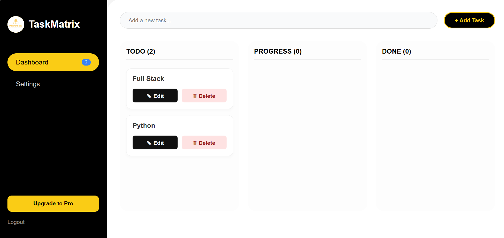
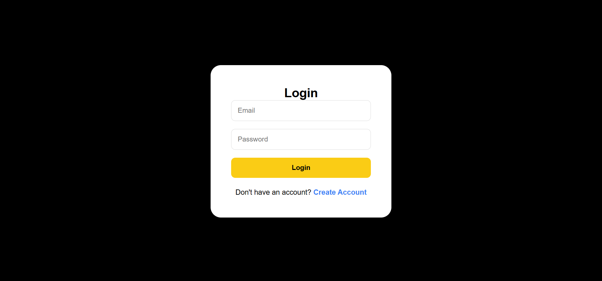

#  TaskMatrix – Professional Task Management System

TaskMatrix is a modern **full-stack productivity application** built using the MERN stack.  
It helps users manage tasks efficiently with a clean UI and real-time workflow system inspired by tools like Trello.

---

##  Live Demo

- 🔗 Frontend (Vercel): https://prodesk-capstone-task-matrix.vercel.app/  
- 🔗 Backend (Render): https://prodesk-capstone-taskmatrix-2.onrender.com 

---

##  Core Features

###  Authentication & Security
- Secure authentication using **JWT (JSON Web Tokens)**
- Password hashing with **Bcrypt**
- Protected routes (only logged-in users can access their data)

---

###  Task Management (CRUD)
-  Create new tasks  
-  View tasks in dashboard  
-  Edit/update tasks  
-  Delete tasks with confirmation  

---

###  Workflow System
Tasks are organized into:

- 🟣 **To Do**
- 🟡 **In Progress**
- 🟢 **Completed**

---

###  Real-Time Updates
- Instant UI updates (no page reload)
- Smooth user experience using React state management

---

###  Payment Integration
- Integrated **Stripe Checkout (Test Mode)**
- “Upgrade to Pro ” feature
- Redirects to success page after payment

---

###  UI/UX
- Built using **Tailwind CSS**
- Clean, modern, responsive design
- Alerts powered by **SweetAlert2**

---

##  Tech Stack

### Frontend
- React.js (Vite)
- Tailwind CSS
- React Router DOM
- SweetAlert2

### Backend
- Node.js
- Express.js
- MongoDB Atlas
- Mongoose
- JWT Authentication
- Bcrypt

---

## 📸 Screenshots

### Dashboard


### Login

---

##  Installation & Setup

### 1️ Clone Repository
```bash
git clone https://github.com/yourusername/taskmatrix.git
cd taskmatrix
```
### Backend Setup
cd backend
npm install

### Create .env file

PORT=5000
MONGO_URI=your_mongodb_uri
JWT_SECRET=your_secret_key
STRIPE_SECRET_KEY=your_stripe_secret
CLIENT_URL=http://localhost:5173

### Frontend Setup
cd frontend
npm install

### Create .env file
VITE_API_URL=http://localhost:5000
npm run dev


